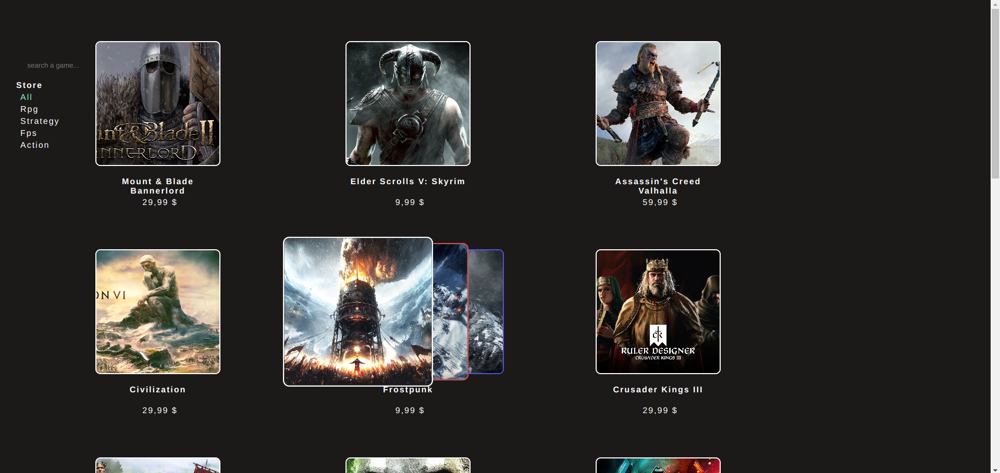
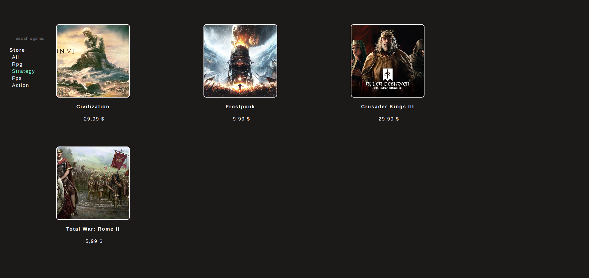
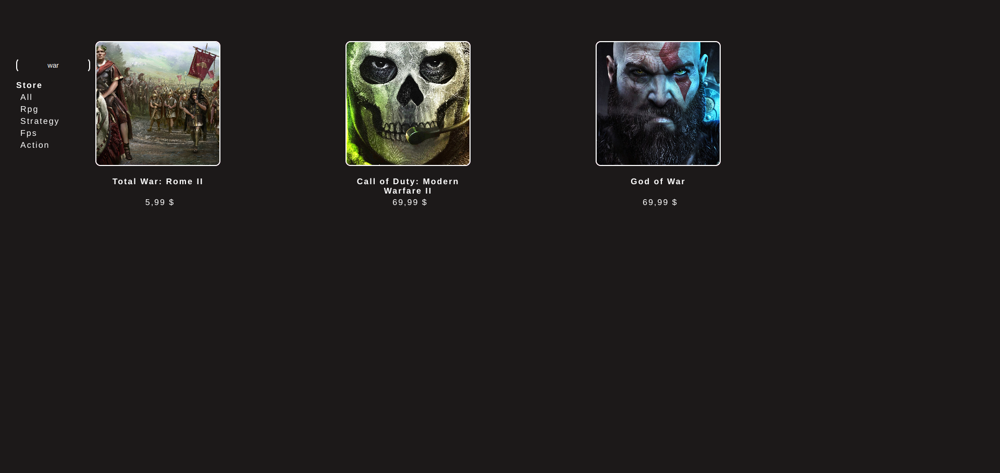

# FILTER PROJECT

## FRONTEND PRACTICE PROJECT NO: 19

1. I used Javascript, Jquery, HTML, CSS to practice my skills.

2. There are games which are seperated by category.

3. On mouse over we can see some of their photos.

4. When we write letters on search bar, app gets the proper games without any selected category from all games.
